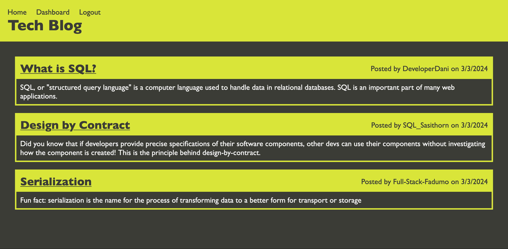

# Tech Blog

## Description

This project is a content management system (CMS) style tech blog. It allows users to create an account or log in to their existing account, make blog posts, edit and delete their posts, and add comments to posts. Additionally, anyone can view the posts on the homepage of the blog.

This project was created as a full stack web app in the MVC pattern. It uses a Node.js backend, with an Express server, MySQL database, and Sequelize ORM. It uses Handlebars for its templating. Additionally, bcrypt is used for password hashing, express-session is used to set up user sessions, connect-session-sequelize is used to store session data, and dotenv is used to provide environment variables.

Since this is an MVC app, the Sequelize data models are located in the `models` directory, the Handlebars-based webpages are in `views`, and the modular Express web and API routes are located in `controllers`. Additionally, the code to set up the Sequelize connection is in `config`, SQL code to create the database (but not populate it) is in `db`, the CSS and JS files used by the frontend are in `public`, the code and data used to seed the database are in `seeds`, and helper functions are in `utils`.

Working on this project made me appreciate again how much goes into fullstack web development, but completing it made me more confident that I can develop this sort of application.

## Installation

If you want to run the server locally, you can install this project by cloning the repository from GitHub, then navigating to the project directory in your terminal and running `npm install`.

If you only want to use the app, no installation is needed.

## Usage

To spin up the server locally, use your terminal to navigate to the project directory and run the command `npm start`. The port used by the server will be logged to the command line.

If you have spun up a local instance of the server, navigate in your web browser to `http://localhost:PORT`, where `PORT` is the port being used by the server (3001 by default).

Otherwise, the app is deployed to Heroku and can be accessed by visiting https://peaceful-ocean-56883-ea5620773588.herokuapp.com/ in your web browser.

From the homepage of the blog, you can view posts that have been made. You can sign up or log in by clicking on the Login link in the navbar. Once logged in, you can view, edit, and delete your own posts, or make a new post, from your dashboard. You can find your dashboard by clicking on the Dashboard link in the navbar. If you want to logout, click on the Logout button in the navbar.

Here is a screenshot of how the main page of the app should appear:

## Credits

All code included in this project is my own, unless otherwise noted. Some of the code closely follows the example of code provided by edX Boot Camps LLC, especially the (largely boilerplate) files `config/connection.js` and `server.js`.

## License

This project is licensed under the GNU General Public License version 3. See [LICENSE](./LICENSE) for the full text of the license.